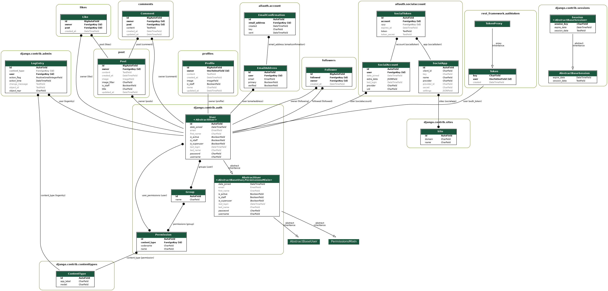

# Freetime API

## Project Goals

This project provides a Django Rest Framework API for all types of platforms.
I will connect it to a frontend thats running React as its framework.

## Table of Contents

- [Freetime API](#freetime-api)
  - [Project Goals](#project-goals)
  - [Table of Contents](#table-of-contents)
  - [Planning](#planning)
  - [Database Structure](#database-structure)
  - [Models](#models)
    - [Profile](#profile)
    - [Post](#post)
    - [Comment](#comment)
    - [Likes](#likes)
    - [Followers](#followers)

## Planning

Planning was done with user stories for the here for the backend. I started to lay up the most important models and their relationships. I also started to think about the endpoints and the serializers. I also started to think about the frontend and the components I would need. I will try to make a API that is versatile and can be used for many different types of platforms. I will also try to make the API as secure as possible. See if I can use JWT tokens for authentication.

The backend will have features for a blog/social media platform. Users can create posts, like posts, comment on posts, follow other users and have a profile. And have the ability to upload images.
I want to merge it so it can be a e-commerce platform as well. I will have to think about how to implement that.

## Database Structure

I used the graph_models from django_extensions to generate the image. The image is available in the documentation folder.

## Models

Data model was planned in parallel with the user stories and API endpoints.
Database models are defined in the models.py file. The models are:

### Profile

It represents the user profile, using one to one relationship to a user model.
It automatically creates a profile when a user is created.

| Database Value               | Field Type    | Field Argument                                                |
| ---------------------------- | ------------- | ------------------------------------------------------------- |
| owner                        | ForeignKey    | User, on_delete=models.CASCADE                                |
| created_at                   | DateTimeField | auto_now_add=True                                             |
| updated_at                   | DateTimeField | auto_now=True                                                 |
| is_staff                     | BooleanField  | default=False                                                 |
| first_name                   | CharField     | max_length=255, blank=True                                    |
| last_name                    | CharField     | max_length=255, blank=True                                    |
| content                      | TextField     | blank=True                                                    |
| image                        | ImageField    | upload_to='images/', default='../default_profile_j1uwjo'      |

### Post

| Database Value               | Field Type    | Field Argument                                                |
| ---------------------------- | ------------- | ------------------------------------------------------------- |
| title                        | CharField     | max_length=255                                                |
| content                      | TextField     | blank=True                                                    |
| created_at                   | DateTimeField | auto_now_add=True                                             |
| updated_at                   | DateTimeField | auto_now=True                                                 |
| owner                        | ForeignKey    | User, on_delete=models.CASCADE,related_name="posts"           |
| image                        | ImageField    | upload_to="images/", default='../default_post_sqpxy8', blank=True,       |
| image_filter                 | CharField     | max_length=32, choices=image_filter_choices, default='normal'      |

### Comment

| Database Value               | Field Type    | Field Argument                                                |
| ---------------------------- | ------------- | ------------------------------------------------------------- |
| owner                        | ForeignKey    | User, on_delete=models.CASCADE                                |
| post                         | ForeignKey    | Post, on_delete=models.CASCADE                                |
| created_at                   | DateTimeField | auto_now_add=True                                             |
| updated_at                   | DateTimeField | auto_now=True                                                 |
| content                      | TextField     | blank=True                                                    |

### Likes

| Database Value               | Field Type    | Field Argument                                                |
| ---------------------------- | ------------- | ------------------------------------------------------------- |
| owner                        | ForeignKey    | User, on_delete=models.CASCADE                                |
| post                         | ForeignKey    | Post, related_name='likes', on_delete=models.CASCADE          |
| created_at                   | DateTimeField | auto_now_add=True                                             |

### Followers

| Database Value               | Field Type    | Field Argument                                                |
| ---------------------------- | ------------- | ------------------------------------------------------------- |
| owner                        | ForeignKey    | User, related_name='following', on_delete=models.CASCADE      |
| followed                     | ForeignKey    | User, related_name='followed', on_delete=models.CASCADE       |
| created_at                   | DateTimeField | auto_now_add=True                                             |
